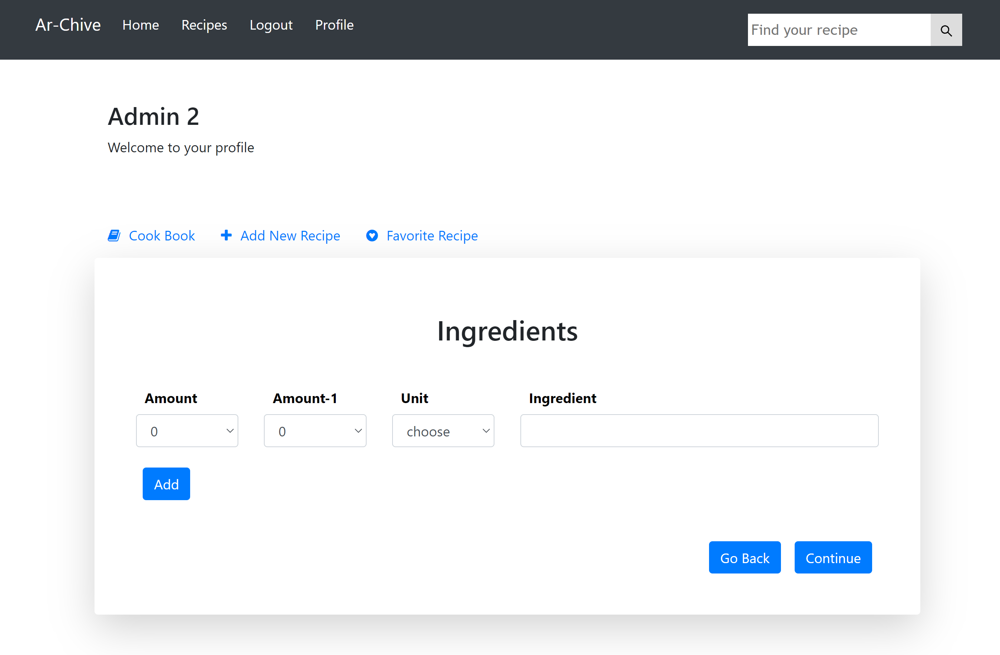
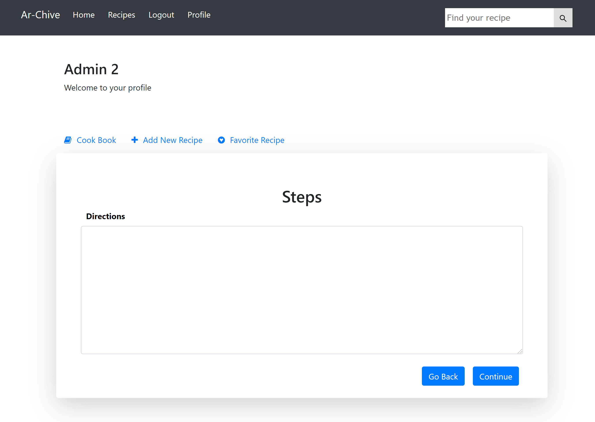
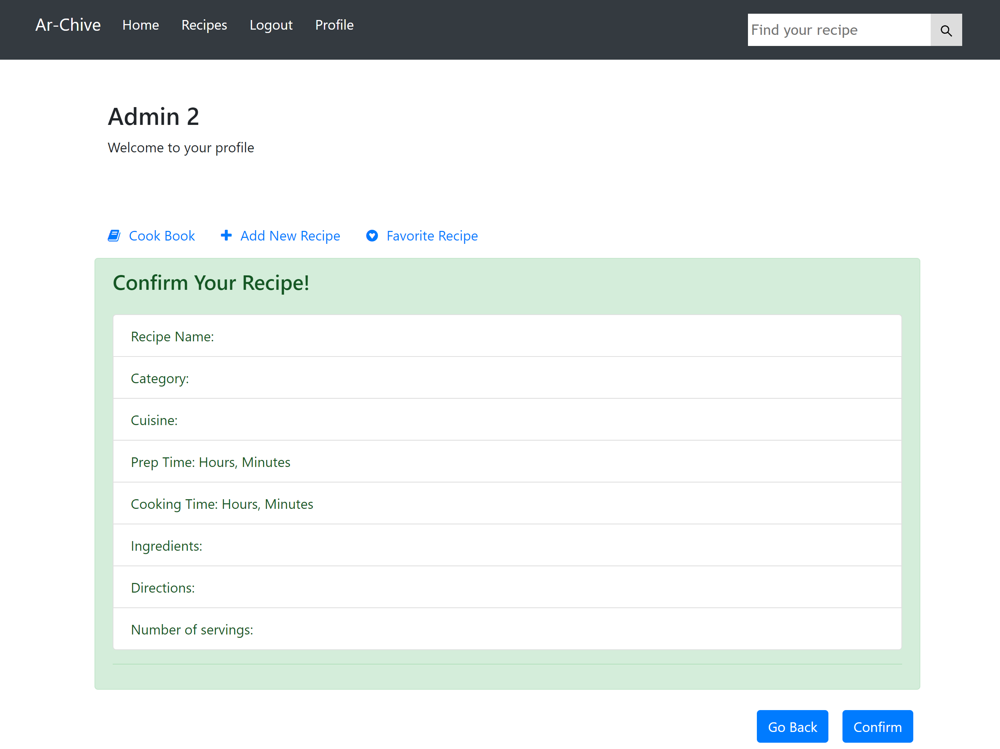
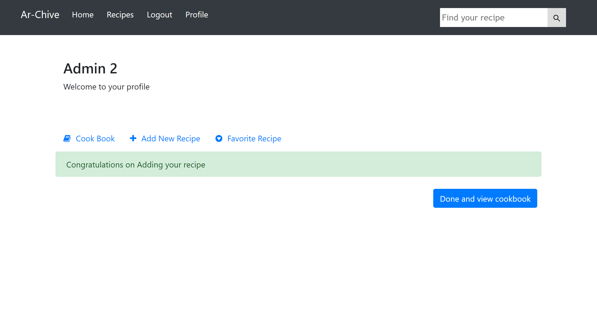
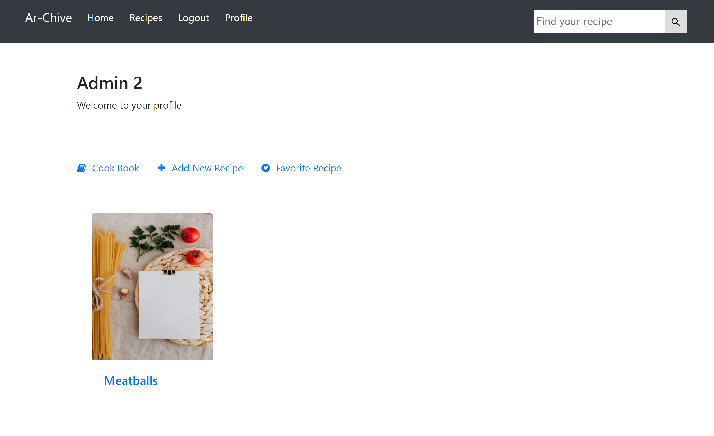
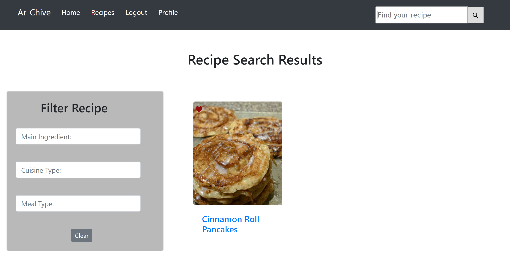

# Ar-Chive
## Description
Ar-Chive is a mobile first React full stack application designed to serve as a digital cookbook while allowing the discovery of brand-new recipes.

## Table of Contents

[Description](#Description)

[Technologies](#Technologies)

[User-Story](#User-Story)

[Local-Installation](#Local-Installation)

[Invoking-the-application-locally](#Invoking-the-application-locally)

[Usage](#Usage)

[Application-Design-and-Featuresage](#UsApplication-Design-and-Featuresage)

[License](#License)

[Badges](#Badges)

[Contributing](#Contributing)

[Future-Development](#Future-Development)

[Contributors](#Contributors)

[Future-Development](#Future-Development)

[Tests](#Tests)

[Deployed-Link](#Deployed-Link)

[Questions](#Questions)

## Technologies:
### Frontend Techs
1. React.js
2. Bootstrap 5
3. HTML
4. CSS 3
5. JavaScript

### Backend Techs
1. Nods.js
2. JavaScript

### Database
1. MongoDB

### Dependencies and Packages
1. axios
2. bcrypt
3. cors
4. dotenv
5. express
6. if-env
7. mongoose
8. omega-react-js-search
9. bootstrap
10. react-bootstrap
11. react-dom
12. react-router-dom
13. recipe-scraper

## User Story: 
As a food enthusiast, I want to have a hub that provides me with access explore new recipes to broaden my culinary horizons and save them for later, have my own profile to create recipes and save them in a personal digital cook book to be accessed easily anywhere.

## Local Installation
1. Clone the repository from github
2. Open the integrated teminal in VS Code or any o ther terminal of your choice and type the command `npm i` to install all the packages in the package.json file included

## Invoking the application locally
To invoke the application locally, in the integrated terminal of VS Code or any o ther terminal of your choice, type the command `npm start`

## Usage
Ar-Chive enables the application user to brwse for recipes and explore, save recipes for later experementing. The application also provides the user with the experience of having a personal profile where the user can create their own recipes and save them digitally in a cook book to access anywhere when needed and also be able to see any favorite recipes without the need to search for these recipes everytime. 

## Application Design and Features
Ar-Chive is designed as a mobile first React application. The application utilizes React components to be used in multiple pages giving the application the feel of a mobile application. 

**Pages and Components**
Pages | Components Utilized 
------------ | -------------
Homepage | Navbar, Hero, Header, Food Card, Show More Button, Searchbox
Recipe Page | Navbar, Food Card
Signup Page | Navbar, Signup, Header
Login Page | Navbar, Login Form, Header
Profile | Navbar, Profile Info, Profile Main Nav
Recipe Search Results | Navbar | Header | Filter | Food Card Container
Recipe Details Page | Navbar | Header | Recipe Details Sidebar | Recipe Details Body

**Homepage**
The Homepage provides the user a clean UI for easy navigation. The Navbar display changes based the user status, upon accessing the application the user is presented with Signup and Login options:
* Clicking on the signup takes the user to the signup page to signup:
    * The user can signup one time with an e-mail, if the user tries to signup with the same e-mail twice the user will be presented with a message that the user already exists
* once the user is signed up the signup will disappeare fromt he Navbar and be replaced with login Logout and Profile
* The user can then chose to logout, the Navbar will change to provide Signup and Login options
* The user can chose to login directly with an existing e-mail, once the user chooses to login, if the user enters a wrong password the user will be presented with a message that indicates that the e-mail or password are incorrect
* onc the user is logged in the Navbar will show the logout and profile tabs

Upon signing up the user will be redirected to their profile page to start using the features provided with each personal profile

**Signup Page**
The signup Page enables the application user to signup using their username, e-mail, password and to provide their cooking ability level. The cooking ability level is a future development phase to personalize each user profile, please refer to the future development phase section.

The signup is designed with validation so that a user cannot signup with the same e-mail more than one time, if the user attempts to signup with an existing e-mail address the user will be presented with an error message that indicated that the e-mail already exists. Once the user is successfully signedup the user is redirected to their profile page. 

**Login Page**
The Login Page enables the application user to login with an existing e-mail and password. The login page also enables the user to signup instead if they accidentally go to the login page when they do not have an account.

The login is designed with validation so that the user cannot enter a wrong password, if the user attempts to login with a wrong e-mail or password the user will be presented with an error message that indicated that the e-mail or password are incorrect. 

**Profile Page**
The Profile page is deisgned to be simple for the user to navigate and start exploring the website, add any recipes the user is interested in to the favorite section of their profile or create their own recipes and save them in a cook book.

The profile page greets the user with a welcome message that renders their username dynamically through their signup and login informaiton that is stored int the backend database of the application. 

**Profile Page - Add a New Recipe**
Through the profile page, the user can add a new recipe to save it in their cookbook. Adding a new recipe is designed using a multi-step react form that stores the data in each step which enables the user to go back and forth while creating the recipe to adjust any step. 

_**Step 1 - Basic Information**_
The basic informaiton step provides the user with the initial recipe informaiton: recipe name, category drop-down menu (i.e. breakfast, luch, dinner ...), Cusine text-box, Number of Servings drop-down menu, Prep-Time drop-down menu (hours and minutes), cooking Time drop-down menu (hours and minutes).

Once the user is done adding all the information, the user can continue to go to Step 2.

_**Step 2 - Ingredients**_
The ingredients step provides the user with the ingredients needed for the recipe, the ingredients include a form to fill in the Amount of ingredients needed along with the unit of measurement and the ingredient name. The ingredients step introduces the Go Back button in case the user wishes to go back to the previous step to adjust information in Step-1 and a Continue button to move to Step-3

_**Step 3 - Directions**_
The Directions part of the adding recipe form provides the user with a multi-line text box to enter the cooking steps and directions. The directions step provides the Go Back button in case the user wishes to go back to the previous step to adjust information or a Continue button to move to Step-4.

_**Step 4 - Recipe Confirmation**_
The Confirmation step provides the user with a summary to all the informaiton added in the precious 3 steps to confirm or go back to adjust anything. 

_**Step 5 - Success**_
The Success step provides the user with a message that the recipe has been successfully added and the form includes a button to view in the cook book.

**Cook Book**
The Cook Book section of the user profile is where the use uis redirected to once a recipe is created. It displays a card that is clickable with a title of a recipe that has been added bu the user, once the user clicks on any of those the user is redirected to the recipe details page which displays the recipe with all its steps.

**Favorite**
The logged in user can see the homepage with an added component in the recipe cards which is the Favorite Component. When the user is logged in the cards that include the recipes provide a clickable part to favor a recipe and then view this recipe within their profile page in the favorite seaction. The user can click on the card or the card title and will be redirected to the recipe details page. 

**Recipe Details Page**
The recipe details page is the page the user is redirected to whenever the user clicks on any recipe card through the application. 

**Search**
The Navbar provides the user with the ability to search for a recipe. Once the user types a name of the recipe they wish to search for they can either use the mouse click or enter to invoke the search process. The user then will be redirected to a Search Results Page which will show the search result.

**Search Result Page**
The Search Result Page is the page the user is redirected to upon completing a search for a recipe. The user also has the ability to add a recipe to favorites through this page. The Filter in the searc results page enables to filter using: main ingredient, cusine type and meal type in case the user received more than one result for their search and wish to narrow down the search. 

## License

## Badges

## Contributing 
To contribute to this project, please make sure you follow the guidelines in [The Contributor Covenant](https://www.contributor-covenant.org/) as general guidelines.
Kindly maintain the highest ethics and respect. 

## Future Development:
The developers of this application have a longterm future development plan for Ar-Chive:
1. User interaction with other users
2. Comment on a recipe
3. Categories to classify recipes and allow the user to dig deeper 
4. Dynamically adjust the ingredients of a recipe based on a serving size
5. Personal shopping list that is generated using recipes
6. Enabling image uploading to personal profile and recipes
7. Ability to delete or update a recipe that the user creates
8. Rate a recipe

## Contributors
* [Noha Ashraf](https://www.github.com/NohaAshraf85)
* [Luc Burns](https://www.github.com/lbburnsy)
* [Brittany Plummer](https://www.github.com/BrittPlum)
* [Suzanne Radlein](https://www.github.com/srad25)
* [Erin Seppala](https://www.github.com/aseppala98)

## Tests
The application front-end has been tested on the browser and on multiple devices to test the responsiveness while the backend has been tested using insomnia core for routes testing.

## Deployed-Link
The application backend mongoDB database is deployed on Atlas, and the full applicaiton is deployed on heroku, you can access the application through the following link: https://infinite-citadel-91130.herokuapp.com/ 

## Questions
For any questions, please contact the contributers through the following contacts:
1. Noha Ashraf:  [GitHub](https://github.com/NohaAshraf85) or [Email](mailto:noha_Ashraf85@hotmail.com)
2. Brittany Plummer: [GitHub](https://github.com/BrittPlum) or [Email](mailto:brittanyplummer@gmail.com)
3. Suzanne Radlein: [GitHub](https://github.com/srad25) or [Email](mailto:suzanne.radlein@gmail.com)
4. Luc Burns: [GitHub](https://github.com/lbburnsy) 
or [Email](mailto:burnsluc@gmail.com)
5. Erin Seppala: [GitHub](https://github.com/aseppala98) 
or [Email](mailto:SeppalaErin98@gmail.com)

